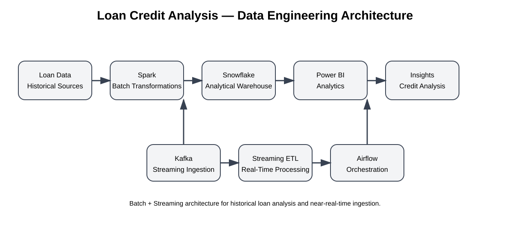

# Loan Credit Analysis — End-to-End Data Engineering Project

A data engineering project built around historical loan data, combining batch processing, streaming ingestion, dimensional modeling, and workflow orchestration.


## Project overview

This was my ITI Data Engineering final project. The main goal was to build a pipeline that could handle historical loan data while also demonstrating how new events could be processed as a stream.

The project therefore has two sides:

- Batch processing for historical data
- Streaming processing for new events

The data is transformed and modeled for analytical use, while Airflow is used to organize workflows and Kafka provides the streaming layer.

The repository contains the transformation and loading notebooks, Kafka producer, streaming Python process, Docker Compose environment, and Snowflake model diagram. fileciteturn7file0

## Architecture



The main flow can be summarized as:

```text
Historical Data -> Spark -> Snowflake -> Analysis

New Events -> Kafka -> Streaming Processing -> Analytical Storage
                         ^
                         |
                      Airflow
```

The Docker environment includes services for Airflow, PostgreSQL, Redis, Kafka, and Zookeeper. fileciteturn11file0

## Data model

The warehouse model separates descriptive information from measurable loan events.

The main entities include:

- Borrower
- Second Borrower
- Loan Product
- Hardship
- Loan Fact

The repository also includes a Snowflake model diagram and separate notebooks for loading the dimensions and fact table. fileciteturn7file0

## Batch pipeline

The batch side of the project is implemented through a set of Jupyter notebooks.

Some of the main steps are:

1. Prepare and transform the historical source data.
2. Clean and standardize the records.
3. Load borrower and supporting dimensions.
4. Load the loan fact table.
5. Validate the resulting warehouse data.

Relevant notebooks include:

- `Transformations_2014_18.ipynb`
- `Transformations_2019_20.ipynb`
- `DIM_BORROWER_Loading.ipynb`
- `Dim_Hardship_load.ipynb`
- `Dim_LoanProduct_load.ipynb`
- `Dim_SecondBorrower_load.ipynb`
- `Fact_Table_Load.ipynb`

## Streaming pipeline

For the streaming part, Kafka is used to simulate a continuous flow of loan-related events.

The basic process is:

1. A producer publishes events to Kafka.
2. The streaming process consumes the events.
3. Incoming data is transformed as needed.
4. The processed records are loaded into the analytical layer.

The repository includes `kafka_producer.ipynb` and `load_to_DIM_Borrower_STREAMING.py` for this part of the implementation. fileciteturn7file0

## Orchestration

Airflow is used to make the pipeline repeatable instead of depending entirely on manual execution.

It can be used to define task dependencies, schedule processing, monitor runs, and retry failed tasks.

## Technology stack

| Technology | Role |
|---|---|
| Python | Pipeline and streaming logic |
| Apache Spark | Data transformation and processing |
| Snowflake | Analytical warehouse |
| Apache Kafka | Event streaming |
| Apache Airflow | Workflow orchestration |
| Docker | Local infrastructure |
| Jupyter | Development and data exploration |

## Running the project

### Requirements

- Docker Desktop
- Python 3.x
- Jupyter Notebook or JupyterLab
- Snowflake account if the warehouse layer is used

### Start the environment

```bash
docker compose up -d
```

After the services are running, the notebooks and streaming components can be executed according to the pipeline flow above.

The Docker Compose file currently contains development credentials. These should be replaced with environment variables or a proper secrets manager before using the setup beyond local development. fileciteturn11file0

## What I learned from the project

The biggest value of this project was seeing how different Data Engineering concepts fit together. Spark, Kafka, Snowflake, and Airflow each solve a different problem, but the pipeline only becomes useful when they are connected into a coherent data flow.

This project gave me hands-on practice with batch and streaming processing, dimensional modeling, orchestration, Dockerized services, and analytical data loading.

## Author

**Fady Elhosary**  
Data Engineer

- LinkedIn: [Fady Elhosary](https://www.linkedin.com/in/fady-elhosary-68064a338/)
- Email: fadymohamed1@gmail.com
